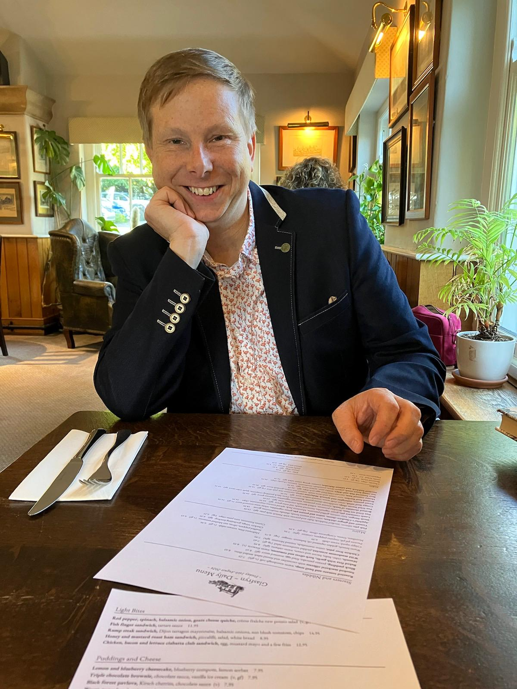

(_This page is mostly going to be work focused. If you're looking for something other than that, take a look at [my personal articles](/tags/personal)_).

Hi, I'm Ben, an experienced Senior Software Engineer, who has spent most of my career focused on frontend technologies like React, Svelte and Vue, and writing isomorphic JavaScript code for both GraphQL and REST APIs.

I enjoy working with diverse teams and collaborating closely with others to achieve common objectives. I also have technical leadership skills.

## Senior Engineer Successes:

### Leading initiatives

I was Lead developer and directly responsible to senior management on a chat application, utilizing a new GraphQL API, which also involved building new UI elements, caching queries and sequential loading (as the GraphQL team had not yet built subscriptions due to complications from underlying APIs).

### Refactoring and improvements

Over a 10 month period, I rebuilt a React application (Gatsby) from the ground up to be from JavaScript to TypeScript (with `strict` enabled), with 60-70% test coverage, both unit and end-to-end, and utilize internal react components, and integrated it with several APIs.

### Using new and advanced JS functionality

I completely re-wrote a video tracker application which allowed my company to track multiple videos on a web page. The service used Service Workers and browser Cache to offload main thread work. This allowed it to respond to events posted by the video players (of which there could be multiple on a page, from Vimeo, YouTube and various others), sending data for the correct video, user and other tracking data to an API. It was built on Vite and hosted as a package on NPM.

## Engineering Management Successes:

### Strategy and Planning

I was tech lead for my team which involved reporting to senior management and colleagues, writing documentation, composing test cases etc.

I also identified an opportunity to drastically reduce operating costs by replatforming to a much more cost effective service (from Kubernetes pods to a service similar to Netlify), and investigated strategies to do so.

### Chairing Guilds

I voluntarily supported a large organisation's Guild for frontend, which enabled engineers of the same discipline who were embedded in cross-functional teams to collaborate, share resources, and obtain support.

I was involved in strategy, direction and organisation, for a time as the sole chair, and for a time I partnered with a colleague. 

### Mentoring and Training

As Senior Engineer, I regularly helped other junior & mid-level engineers to learn debugging methods and React APIs to help them deliver their work.

This involved weekly one-to-ones and some group collaboration. At times, it meant talking to them out of office hours in order to listen to their concerns and investigate how I could help alleviate stressful situations and personal conflicts.

### Improving workflows

Whilst I try to work with the workflows I'm given, I am not averse to challenging them when it can lead to benefits for the organisation and the team. As the following shows.

Noticing that a team was missing opportunities to improve it's processes, I instituted a weekly retrospective meeting which facilitated cascading changes across the team. This allowed us to increase our velocity and improved the wellbeing of team members. I chaired the meeting and maintained a continuous record of what had been discussed for future reference.

I also noticed that the Testing / QA facility was working very slowly. I worked with them and my team to improve our processes. This included asking engineers to write test criteria in the Gherkin syntax (Given / When / Then), which improved focus for the single test engineer on hand. 

### Writing Documentation

I created and maintained a document outlining the different codebases within a business (this I did when I was sole JavaScript Engineer). This was a living document which outlined plans for improvement for each codebase.

The document also outlined a set of standard tools to use so that I could gradually standardise the codebase and make it more easily maintainable. For example, I decided that all codebases were to be formatted using AirBnB Styleguide, use Vite as a compiler, come with an `.env.example` file and they should have at least 80% test coverage.

I also made recommendations about which packages to use (eg. recommended the use of TanStack Query). 

The objective to this documentation was that any new engineers coming into the team could easily pick up a new code base and fulfil any business requirement without having to do unnecessary decision making, with the aim of making us more efficient as a team.   

### Can I help you to deliver?

I love working in engineering teams that have a clear organizational structure and roadmap. I also like working in environments that have a healthy work-life balance and have a standard holiday package. I do not work for companies in gambling, military or adult entertainment sectors or blockchain related markets.

You can contact me via [LinkedIn](https://www.linkedin.com/in/benjaminread1980/). I look forward to discussing your requirements.