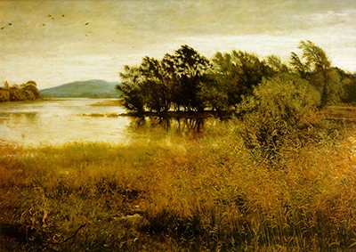

Delicious Reverie is the personal blog of [Benjamin Read](/about-benjamin-read), a web developer previously residing just outside London, UK, but more recently in North Wales. 

## The Design

The style of the site reflects my enjoyment of the countryside, especially during the fresh, bright winter days we often get in the UK after an intense storm has passed.

I particularly enjoyed taking long walks around Aylesbury and Tring reservoirs where we lived in Hertfordshire after one of these storms. During those walks I would frequently be reminded of the classical musical piece "The Lark Ascending" by Vaughn Williams and the painting "Chill October" by John Everett Millais.

<iframe style="border-radius:12px" src="https://open.spotify.com/embed/track/4qwyDI0dW7hhQbQXUfHOUv?utm_source=generator" width="100%" height="152" frameBorder="0" allowfullscreen="" allow="autoplay; clipboard-write; encrypted-media; fullscreen; picture-in-picture" loading="lazy"></iframe>

That's the visual influence behind my design choices. 

## The animations

There are a few subtle story animations on this site, one of an otter, and another of some wild rabbits. Can you find them?

## Typography

Text and background colours have been selected that hopefully improve readability for those with cognitive and visual impairments.

The original font on this site was Skybird. As soon as I saw the "Skybird" typeface I fell in love with it. It perfectly reflects my interest in a personal, home-grown, labour-of-love approach to crafted work instead of what can end up looking mass-produced, impersonal and somewhat homogenous.

However, I've recently moved to "Lovechild" to reflect my growing interest in the folk & roots movement of the 70s, which eschewed conformity in favour of a similar homegrown, personal feel towards things. Also, I recieved a few comments that the font "Skybird" was difficult to read for people with dyslexia, and I don't want to limit access to my content for them.

## The Name

I called this site "Delicious Reverie" after an expression which occurs in Norman Denny's English translation of Victor Hugo's epic masterpiece Les Miserables.

After being reminded of one of his favourite books, a minor charachter, Monsieur Mabeuf, is said to slip "into a delicious reverie", which means that he becomes absorbed in his thoughts and memories in a delightful state of meditation.

Deliciousreverie.co.uk is where I share my delicious reveries—Pieces of code, ideas and processes that I gather on my career, as well as some personal anecdotes and my love of classical, French, Russian, Chinese and English literature.

I hope you find something that inspires you.
